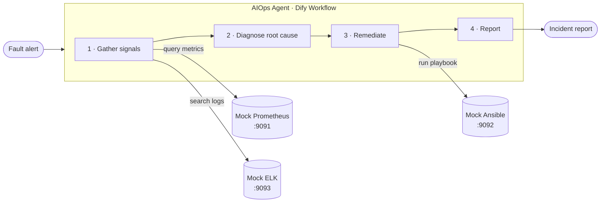

# AIOps Incident Agent

> An LLM agent that takes a production alert from detection to resolution — **autonomously**. It pulls metrics and logs, diagnoses the root cause, runs a remediation playbook, and writes the incident report. No human in the loop.


This is a reference implementation of a **closed-loop AIOps agent**. A fault alert fires; the agent investigates like an on-call SRE would — check the dashboards, read the logs, form a hypothesis, apply a fix, verify — and hands back a written report. Observability backends (Prometheus, Elasticsearch/ELK, Ansible) are provided as lightweight mocks so the whole loop runs on a laptop.

## How it works



The agent runs a five-step loop:

1. **Gather signals** — query time-series metrics (Prometheus) and error logs (ELK) for the affected service.
2. **Diagnose** — the LLM correlates the signals into a root-cause hypothesis.
3. **Remediate** — pick and execute the matching Ansible playbook (restore DB pool, clean disk, restart service).
4. **Verify & report** — confirm recovery and emit a structured incident report.

## Scenarios

Three faults ship with the demo, each with a known ground-truth root cause so you can check the agent's reasoning:

| Scenario  | Service           | Symptom                              | Root cause                          | Remediation             |
| --------- | ----------------- | ------------------------------------ | ----------------------------------- | ----------------------- |
| `db`      | order-service     | API latency 200ms → 1.5s             | DB connection pool misconfigured    | `restore_db_pool.yml`   |
| `disk`    | file-service      | `/data` partition at 98%             | Disk space exhausted                | `clean_disk_space.yml`  |
| `network` | payment-service   | Rising payment failure rate          | Network partition                   | `restart_service.yml`   |

## Quickstart

### 1. See the loop without any setup

The trigger script has an offline mode that walks through exactly what the agent does — no servers, no keys:

```bash
python trigger_fault.py db --simulate
python trigger_fault.py --list
```

### 2. Run the mock backends

```bash
pip install -r requirements.txt
./deploy.sh          # starts mock Prometheus / ELK / Ansible via docker compose
```

| Service         | URL                     | Role                         |
| --------------- | ----------------------- | ---------------------------- |
| Mock Prometheus | http://localhost:9091   | Time-series metrics          |
| Mock ELK        | http://localhost:9093   | Log search                   |
| Mock Ansible    | http://localhost:9092   | Playbook execution           |

### 3. Wire up the agent and fire a real alert

The agent brain is a [Dify](https://dify.ai) Workflow app that calls the three mock tools above. Point the script at your Dify instance:

```bash
cp .env.example .env      # then fill in DIFY_API_BASE and DIFY_WORKFLOW_API_KEY
python trigger_fault.py db
```

## Repo structure

```
.
├── trigger_fault.py   # CLI: fire a scenario at the agent (or --simulate offline)
├── deploy.sh          # spin up the mock observability stack via docker compose
├── tools/
│   ├── mock_prometheus.py   # metrics API  (:9091)
│   ├── mock_elk.py          # log search API (:9093)
│   └── mock_ansible.py      # playbook runner API (:9092)
├── .env.example       # configuration template
└── requirements.txt
```

## Tech stack

- **Orchestration:** Dify (LLM workflow / agent)
- **Tools:** Flask mock services standing in for Prometheus, Elasticsearch/ELK, and Ansible
- **Client:** Python + `requests`

## Notes

- The Dify Workflow definition (DSL) is **not** included in this repo — the original hosted instance is gone. To run the full loop you'll need to rebuild a Dify workflow that (a) accepts the alert fields as inputs and (b) calls the three mock tools. The mock APIs are deliberately forgiving about request shape, so they're easy to connect. Until then, `--simulate` demonstrates the intended behavior.
- The mock services return canned-but-realistic data; they exist to exercise the agent's reasoning, not to be real observability backends.

## License

[MIT](LICENSE)
